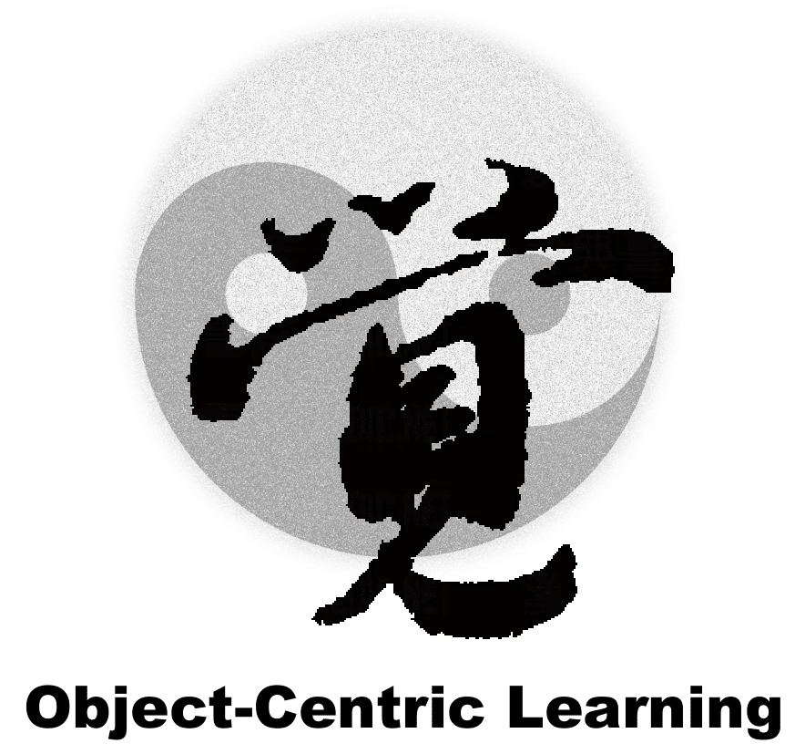

      

# 
`Awesome object-centric learning`

 

 The list will be continually updated. Any recommendations and suggestions are welcomed!

< **Last updated: Apr/25/2023** >
        

  
Table of Contents

  <ol>
    <li>
      <a href="#Datasets">Datasets</a>
      <ul>
        <li><a href="#Synthetic Data">Synthetic Data</a></li>
         <li><a href="#Real-World Data">Real-World Data</a></li>
      </ul>
    </li>
    <li>
      <a href="#Methodologies">Methodologies</a>
      <ul>
        <li><a href="#Year 2023">Year 2023</a></li>
        <li><a href="#Year 2022">Year 2022</a></li>
        <li><a href="#Year 2021">Year 2021</a></li>
        <li><a href="#Year 2020">Year 2020</a></li>
      </ul>
    </li>
    <li><a href="#Contact">Contact</a></li>
  </ol>

## Datasets

### Synthetic Data

[CausalTriplet](https://zenodo.org/record/7813658#.ZEZjeuxByuU)
    
[Neural binder](https://drive.google.com/drive/folders/1FKEjZnKfu9KnSGfnr8oGVUBSPqnptzJc)
    
[Object Scene Representation Transformer](https://osrt-paper.github.io/#dataset)
    
[ClevrTex](https://www.robots.ox.ac.uk/~vgg/data/clevrtex/#)
    
### Real-World Data

## Methodologies

### Year 2023
    
**Year** | **Publication** | **Title** | **Source** | **Forum** |  **Real-World?**  
:-: | :-:| :- | :-: | :-: | :-:
**2023** | **CVPR** | [Improving Cross-Modal Retrieval with Set of Diverse Embeddings](https://arxiv.org/pdf/2211.16761.pdf) | | | 
**2023** | **CVPR** | [Intrinsic Physical Concepts Discovery with Object-Centric Predictive Models](https://arxiv.org/pdf/2303.01869.pdf) | | | 
**2023** | **CVPR** | [Object Discovery from Motion-Guided Tokens](https://arxiv.org/pdf/2303.15555.pdf) | [Code](https://github.com/zpbao/MoTok) | | 
**2023** | **CVPR** | [Shepherding Slots to Objects: Towards Stable and Robust Object-Centric Learning](https://arxiv.org/pdf/2303.17842.pdf) | [Code](https://github.com/object-understanding/SLASH) |  | 
**2023** | **ICLR** | [Bridging the Gap to Real-World Object-Centric Learning](https://openreview.net/pdf?id=b9tUk-f_aG) | | [OpenReview](https://openreview.net/forum?id=b9tUk-f_aG) |
**2023** | **ICLR** | [Improving Object-centric Learning with Query Optimization](https://openreview.net/pdf?id=_-FN9mJsgg) | [Code](https://github.com/YuLiu-LY/BO-QSA) | [OpenReview](https://openreview.net/forum?id=_-FN9mJsgg) | 👍 
**2023** | **ICLR** | [Learning to Reason over Visual Objects](https://openreview.net/pdf?id=uR6x8Be7o_M) | | [OpenReview](https://openreview.net/forum?id=uR6x8Be7o_M) |
**2023** | **ICLR** | [Learning What and Where: Disentangling Location and Identity Tracking Without Supervision](https://openreview.net/pdf?id=NeDc-Ak-H_) | [Code](https://github.com/CognitiveModeling/Loci) | [OpenReview](https://openreview.net/forum?id=NeDc-Ak-H_) |
**2023** | **ICLR** | [Neural Constraint Satisfaction: Hierarchical Abstraction for Combinatorial Generalization in Object Rearrangement](https://arxiv.org/pdf/2303.11373.pdf) | [Code](https://sites.google.com/view/neural-constraint-satisfaction/home) | [OpenReview](https://openreview.net/forum?id=fGG6vHp3W9W) | 
**2023** | **ICLR** | [Robust and Controllable Object-Centric Learning through Energy-based Models](https://openreview.net/pdf?id=wcNtbEtcGIC) | | [OpenReview](https://openreview.net/forum?id=wcNtbEtcGIC) | 
**2023** | **ICLR** | [Neural Groundplans: Persistent Neural Scene Representations from a Single Image](https://arxiv.org/pdf/2207.11232.pdf) | [Code](https://prafullsharma.net/neural_groundplans/) | [OpenReview](https://openreview.net/forum?id=Pza24zf9FpS) | 
**2023** | **ICLR** | [Neural Systematic Binder](https://arxiv.org/pdf/2211.01177.pdf) | [Code](https://github.com/singhgautam/sysbinder) | [OpenReview](https://openreview.net/forum?id=ZPHE4fht19t) | 
**2023** | **ICLR** | [SlotFormer: Unsupervised Visual Dynamics Simulation with Object-Centric Models](https://arxiv.org/pdf/2210.05861.pdf)   **TL;DR:** hahha  | [Code](https://github.com/pairlab/SlotFormer) | [OpenReview](https://openreview.net/forum?id=TFbwV6I0VLg) | 
**2023** | **CLeaR** | [Causal Triplet: An Open Challenge for Intervention-centric Causal Representation Learning](https://openreview.net/pdf?id=HAYU8TRYTCb)   **TL;DR:** hahha   | [Code](https://github.com/CausalTriplet/causaltriplet) | [OpenReview](https://openreview.net/forum?id=HAYU8TRYTCb) | 👍 

### Year 2022
    
**Year** | **Publication** | **Title** | **Source** | **Forum** |  **Real-World?**  
:-: | :-:| :- | :-: | :-: | :-:
**2022** | **UAIw** | [Inductive Biases for Object-Centric Representations in the Presence of Complex Textures](https://arxiv.org/pdf/2204.08479.pdf) | | [OpenReview](https://openreview.net/forum?id=6wbNpKmfEOj) |
**2022** | **TMLR** | [Complex-Valued Autoencoders for Object Discovery](https://arxiv.org/pdf/2204.02075.pdf) | [Code](https://github.com/loeweX/ComplexAutoEncoder) | | 
**2022** | **NeurIPSw** | [Unlocking Slot Attention by Changing Optimal Transport Costs](https://arxiv.org/pdf/2301.13197.pdf) |  | [OpenReview](https://openreview.net/forum?id=27L6M45WI9) | 
**2022** | **NeurIPS** | [Weakly Supervised Causal Representation Learning](https://arxiv.org/pdf/2203.16437.pdf) | | [OpenReview](https://openreview.net/forum?id=dz79MhQXWvg) |
**2022** | **NeurIPS** | [Visual Concepts Tokenization](https://arxiv.org/pdf/2205.10093.pdf) | [Code](https://github.com/thomasmry/VCT) | [OpenReview](https://openreview.net/forum?id=rWgfLdqVVl_&referrer=%5BAuthor%20Console%5D(%2Fgroup%3Fid%3DNeurIPS.cc%2F2022%2FConference%2FAuthors%23your-submissions)) | 
**2022** | **NeurIPS** | [Unsupervised Multi-object Segmentation by Predicting Probable Motion Patterns](https://arxiv.org/pdf/2210.12148.pdf) | [Code](https://www.robots.ox.ac.uk/~vgg/research/ppmp/) | [OpenReview](https://openreview.net/forum?id=_w2-1nXNjvv) | 
**2022** | **NeurIPS** | [Unsupervised Causal Generative Understanding of Images](https://openreview.net/pdf?id=VvOcK2DGM7G) | | [OpenReview](https://openreview.net/forum?id=VvOcK2DGM7G) | 
**2022** | **NeurIPS** | [Self-Supervised Visual Representation Learning with Semantic Grouping](https://arxiv.org/pdf/2205.15288.pdf) | [Code](https://github.com/CVMI-Lab/SlotCon) | [OpenReview](https://openreview.net/forum?id=H3JObxjd8S) | 
**2022** | **NeurIPS** | [SAVi++: Towards End-to-End Object-Centric Learning from Real-World Videos](https://arxiv.org/pdf/2206.07764.pdf) | [Code](https://github.com/google-research/slot-attention-video/) | [OpenReview](https://openreview.net/forum?id=fT9W53lLxNS) |
**2022** | **NeurIPS** | [Promising or Elusive? Unsupervised Object Segmentation from Real-world Single Images](https://arxiv.org/pdf/2210.02324.pdf) | [Code](https://github.com/vLAR-group/UnsupObjSeg) | [OpenReview](https://openreview.net/forum?id=DzPWTwfby5d) |
**2022** | **NeurIPS** | [Object Scene Representation Transformer](https://arxiv.org/pdf/2206.06922.pdf) | [Code](https://osrt-paper.github.io/#code) | [OpenReview](https://openreview.net/forum?id=znNmsN_O7Sh) |
**2022** | **NeurIPS** | [Object Representations as Fixed Points: Training Iterative Refinement Algorithms with Implicit Differentiation](https://arxiv.org/pdf/2207.00787.pdf) | [Code](https://sites.google.com/view/implicit-slot-attention) | [OpenReview](https://openreview.net/forum?id=-5rFUTO2NWe) |
**2022** | **NeurIPS** | [3D Concept Grounding on Neural Fields](https://arxiv.org/pdf/2207.06403.pdf) | [Code](http://3d-cg.csail.mit.edu/) | [OpenReview](https://openreview.net/forum?id=n7Rk_RDh90) |
**2022** | **LoG** | [Reasoning-Modulated Representations](https://arxiv.org/pdf/2107.08881.pdf) |  | [OpenReview](https://openreview.net/forum?id=QBGYYu3l3dG) | 
**2022** | **ICML** | [Unsupervised Image Representation Learning with Deep Latent Particles](https://arxiv.org/pdf/2205.15821.pdf) | [Code](https://taldatech.github.io/deep-latent-particles-web/) | 
**2022** | **ICML** | [Toward Compositional Generalization in Object-Oriented World Modeling](https://arxiv.org/pdf/2204.13661.pdf) | [Code](https://lfzhao.com/publication/2022-oowm/) | 
**2022** | **ICML** | [COAT: Measuring Object Compositionality in Emergent Representations](https://proceedings.mlr.press/v162/xie22b/xie22b.pdf) | | 
**2022** | **CVPR** | [Slot-VPS: Object-centric Representation Learning for Video Panoptic Segmentation](https://arxiv.org/pdf/2112.08949.pdf) | [Code](https://github.com/SAITPublic/SlotVPS) | 
**2022** | **CVPR** | [Interactive Disentanglement: Learning Concepts by Interacting with their Prototype Representations](https://arxiv.org/pdf/2112.02290.pdf) | [Code](https://github.com/ml-research/XIConceptLearning) | 
**2022** | **CVPR** | [HP-Capsule: Unsupervised Face Part Discovery by Hierarchical Parsing Capsule Network](https://arxiv.org/pdf/2203.10699.pdf) |  | 
**2022** | **CVPR** | [Discovering Objects that Can Move](https://arxiv.org/pdf/2203.10159.pdf) | [Code](https://github.com/zpbao/Discovery_Obj_Move/) | 
**2022** | **ICLRw** | [Towards Self-Supervised Learning of Global and Object-Centric Representations](https://arxiv.org/pdf/2203.05997.pdf) | [Code](https://github.com/baldassarreFe/iclr-osc-22) | [OpenReview](https://openreview.net/forum?id=SRfVvBuI9xq)
**2022** | **ICLR** | [Unsupervised Discovery of Object Radiance Fields](https://arxiv.org/pdf/2107.07905.pdf) | [Code](https://github.com/KovenYu/uORF) | [OpenReview](https://openreview.net/forum?id=rwE8SshAlxw)
**2022** | **ICLR** | [Learning Super-Features for Image Retrieval](https://arxiv.org/pdf/2201.13182.pdf) | [Code](https://github.com/naver/FIRe) | [OpenReview](https://openreview.net/forum?id=wogsFPHwftY)
**2022** | **ICLR** | [Evaluating Disentanglement of Structured Representations](https://arxiv.org/pdf/2101.04041.pdf) | | [OpenReview](https://openreview.net/forum?id=SLz5sZjacp)
**2022** | **CLeaR** | [VIM: Variational Independent Modules for Video Prediction](https://openreview.net/pdf?id=bDOU-vlPM8n) | | [OpenReview](https://openreview.net/forum?id=bDOU-vlPM8n)
**2022** | **CoRLw** | [Visuomotor Control in Multi-Object Scenes Using Object-Aware Representations](https://arxiv.org/pdf/2205.06333.pdf) | | [OpenReview](https://openreview.net/forum?id=02QLa91hTl&referrer=%5Bthe%20profile%20of%20Pierre%20Sermanet%5D(%2Fprofile%3Fid%3D~Pierre_Sermanet1))
**2022** | **CoRLw** | [Differentiable Parsing And Visual Grounding of Verbal Instructions for Object Placement](https://openreview.net/pdf?id=w09jBOzi80) | | [OpenReview](https://openreview.net/forum?id=w09jBOzi80)

### Year 2021
    
**Year** | **Publication** | **Title** | **Source** | **Forum** |  **Real-World?**  
:-: | :-:| :- | :-: | :-: | :-:
**2021** | **NeurIPS** | [Unsupervised Foreground Extraction via Deep Region Competition](https://arxiv.org/pdf/2110.15497.pdf) | [Code](https://github.com/yuPeiyu98/DRC) | [OpenReview](https://openreview.net/forum?id=tu5Wg41hWl_)
**2021** | **NeurIPS** | [SIMONe: View-Invariant, Temporally-Abstracted Object Representations via Unsupervised Video Decomposition](https://arxiv.org/pdf/2106.03849.pdf) | [Code](https://sites.google.com/view/simone-scene-understanding/) | [OpenReview](https://openreview.net/forum?id=YSzTMntO1KY)
**2021** | **NeurIPS** | [Object-Centric Representation Learning with Generative Spatial-Temporal Factorization](https://arxiv.org/pdf/2111.05393.pdf) |  | [OpenReview](https://openreview.net/forum?id=cA8Yp87yTiR)
**2021** | **NeurIPS** | [Neural Production Systems](https://arxiv.org/pdf/2103.01937.pdf) | | [OpenReview](https://openreview.net/forum?id=xQGYquca0gB)
**2021** | **NeurIPS** | [Mini-Batch Consistent Slot Set Encoder for Scalable Set Encoding](https://openreview.net/pdf?id=FTdrVlWfvsz) |  | [OpenReview](https://openreview.net/forum?id=FTdrVlWfvsz)
**2021** | **NeurIPS** | [MarioNette: Self-Supervised Sprite Learning](https://arxiv.org/pdf/2104.14553.pdf) | [Code](https://github.com/dmsm/MarioNette) | [OpenReview](https://openreview.net/forum?id=3zP6RrQtNa)
**2021** | **NeurIPS** | [GENESIS-V2: Inferring Unordered Object Representations without Iterative Refinement](https://arxiv.org/pdf/2104.09958v2.pdf) | [Code](https://github.com/applied-ai-lab/genesis) | [OpenReview](https://openreview.net/forum?id=nRBZWEUhIhW)
**2021** | **NeurIPS** | [Dynamic Visual Reasoning by Learning Differentiable Physics Models from Video and Language](https://arxiv.org/pdf/2110.15358.pdf) | [Code](http://vrdp.csail.mit.edu/) | [OpenReview](https://openreview.net/forum?id=lk1ORT35tbi)
**2021** | **NeurIPS** | [Attention over Learned Object Embeddings Enables Complex Visual Reasoning](https://arxiv.org/pdf/2012.08508.pdf) | [Code](https://github.com/deepmind/deepmind-research/tree/master/object_attention_for_reasoning) | [OpenReview](https://openreview.net/forum?id=lHmhW2zmVN)

### Year 2020

## Contact
    
Feel free to drop an e-mail to junpuzhang.2022@gmail.com.
